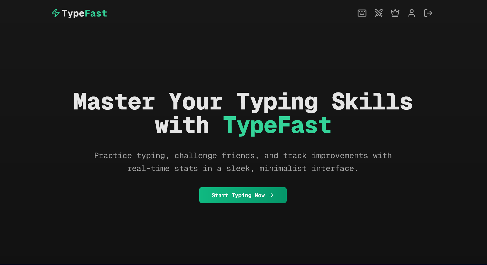

# TypeFast ⚡

A modern, minimalist typing speed test application built with Next.js.



## Features 🚀

- **Real-time Feedback**: Get instant feedback of your typing speed, and accuracy.
- **Challenge Friends**: Compete with friends in real-time typing races.
- **Global Leaderboard**: Compete with typists worldwide
- **Customizable Options**: Choose from different typing modes to suit your needs.
- **Daily Rankings**: Fresh competition every day
- **Detailed Statistics**: Track progress over time with comprehensive stats.
- **Minimalist UI**: Distraction-free sleek design that enhances your focus.

## Tech Stack 💻

- [Next.js](https://nextjs.org/) – React Framework
- [TypeScript](https://www.typescriptlang.org/) - Language
- [Tailwind](https://tailwindcss.com/) – CSS
- [Shadcn UI](https://ui.shadcn.com/) – UI Library
- [Framer Motion](https://motion.dev/) – Animation
- [Ioredis](https://www.npmjs.com/package/ioredis/) Redis
- [Prisma](https://www.prisma.io/) – ORM
- [Auth.js](https://authjs.dev/) – Authentication
- [Zustand](https://zustand-demo.pmnd.rs/) – State Management
- [Resend](https://resend.com/) – Emails
- [PostgreSQL](https://neon.tech/) – Database

## Getting Started 🌟

1. **Clone the repository**

   ```bash
   git clone https://github.com/Kshitiz2431/SwiftKeys-.git
   cd TypeFast-
   ```

2. **Install dependencies**

   ```bash
   yarn
   ```

3. **Set up environment variables**

   ```bash
   cp ./apps/web/.env.example ./apps/web/.env
   cp ./packages/db/.env.example ./packages/db/.env
   ```

4. **Set up database**

   ```bash
   yarn db:setup
   ```

5. **Start development server**

   ```bash
   yarn dev
   ```

6. **Visit localhost:3000**

## Contributing 🤝

Contributions are welcome! Please feel free to submit a Pull Request.

## License 📝

This project is licensed under the MIT License - see the [LICENSE](LICENSE) file for details.
